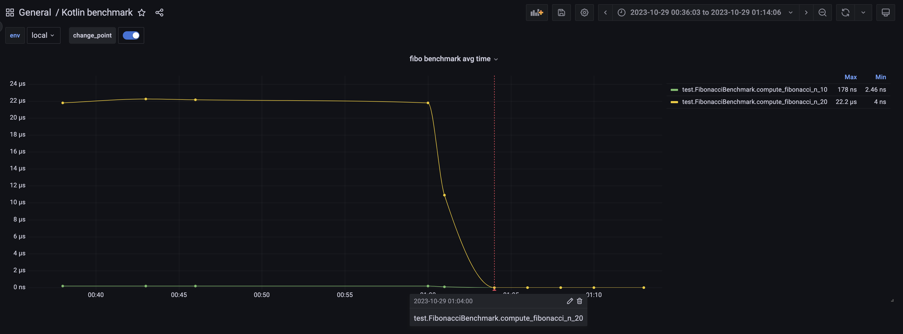

# Kotlin Benchmark Demo

## Description
Simple Kotlin benchmark for Fibonacci function using `kotlinx-benchmark`.

## Features
- Benchmark execution
- CSV reporting
- Summary is sent to `InfluxDB@2` for trend tracking using `Grafana` visual dashboard
- Change point detection

## Getting Started

### Prerequisites
Ensure you have [Kotlin](https://kotlinlang.org/) and [Python](https://www.python.org/) installed.

### Execution

1. **Running the Benchmark**:
    ```bash
    ./gradlew benchmark
    ```

2. **Trend Reporting**:
   Install the required Python packages:
   ```bash
   pip install -r utils/trend/requirements.txt
   ```
   Send the summary to InfluxDB:
   ```bash
   python3 utils/trend/influxdb_send_trend_data.py
   ```

3. **Change Point detection**:
   Detect & send change points to InfluxDB:
   ```bash
   python3 utils/trend/influxdb_detect_send_change_points.py
   ```

## Dashboard Visualization



## TODO - Improvement plan

- CI integration
- Check already detected change points first not to introduce overlaps
- Add different Kotlin platforms (JS, Native, Scripting)
- Add more realistic benchmarks


## Credits
- [JetBrains kotlinx-benchmark](https://github.com/Kotlin/kotlinx-benchmark)
- [MongoDB signal processing algorithms](https://github.com/mongodb/signal-processing-algorithms/tree/master)
